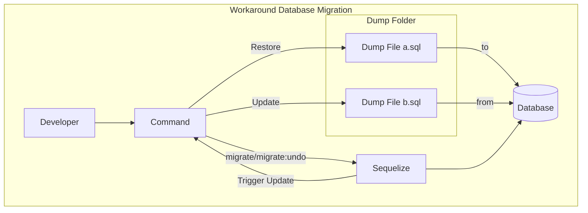

# Get Rid of Sequelize Migration Files

I once join a team that using postgres and sequelize as their ORM, and they have dozens of migration files, when i try to migrate those files, i got a lot of error that saying the same problem coming from migration files.

some error like:

```bash
parent: error: column "column_name" of relation "table_name" does not exist
```

If i try to fix it one by one it will be a lot of work and time consuming, and if in the future we dont maintenance the migration files regurarly, the same issues will come.

Their solution was giving onboarding member dump files for each databases that used on this project from full timer developer. one of the dump files size was around 900 Mb and when i try to restore the dump files, the data that it contain took around 8 Gb of my SSD. I personally doesnt want my storage get decreased by the large volume of the data from dump files, moreover the process of restoring these files can be time consuming.

As another solution, i make a workaround flow to overcome this issue:

- Assume that there is dump folder contains database structure (tables only)
- Execute a command to restore the dump file to the database
- Execute a command to update the dump file.
- If migrate or undo from sequelize then do point 3

This is the solution flowchart:



With this, we can overcome the issue:

- Error prone migration process: this solution provides alternative method that is less prone to errors.
- Cumbersome manual fixes: as stated, fixing errors on each migration files individually would take a lot of work and time consuming. This solution reduces the efforts to fix each migration files.
- Lack of maintenance: This flow providing a mechanism for updating the database structure from and to a dump file.
- Quickly get started: With a single command, we can get the project set up with a new blank database, avoiding the need to restore large dump files and saving significant storage space on our systems.

> **_NOTE:_**
> This is just experimenting from my side, and i think there is maybe a better way to handle this problem. Please let me know what do you think about this solution, like: is there any cons on this solution?, how we can improve it?, etc.

Now that we got the idea, how do we implement it with code? keep reading!

that's it, lastly i want to know how your team handle this issue? please share your experience on the comment section.
